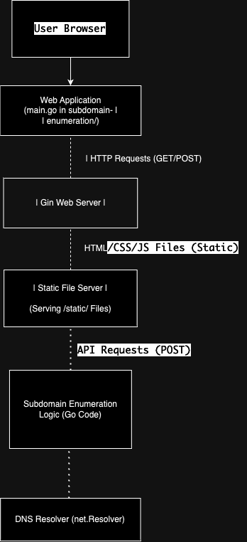

# Subdomain Enumeration Tool

## Introduction

This Subdomain Enumeration Tool is designed to take a URL and provide a list of all subdomains associated with that URL. It's a valuable resource for discovering hidden corners of the web and enhancing your cybersecurity efforts.

### Acknowledgment

This project was initiated by Akhil Sharma, the founder of Armur AI. A special thanks to him for entrusting me with this task.

## Features

- **Subdomain Enumeration**: Easily input a URL, and the tool will enumerate all associated subdomains.

- **User-Friendly Frontend**: We've included a simple and intuitive frontend for an excellent user experience.

- **Cross-Platform**: This project is designed to compile and run seamlessly across various platforms.

## Getting Started

To get started with the Subdomain Enumeration Tool, follow these steps:

1. Clone the repository to your local machine.

2. Navigate to the project directory.

3. Compile and run the tool.

4. Access the user-friendly frontend to start enumerating subdomains.

## Architecture

Here's an overview of the project's architecture:

- **Frontend**: The user interacts with the tool through a frontend interface, making it accessible and user-friendly.

- **Backend**: The backend handles the URL input, subdomain enumeration, and provides the results to the frontend.

#Please note that as of now, the backend API request is not functional, but rest assured, it's a work in progress. We are actively working on resolving this issue and will have it fixed soon. Your patience is greatly appreciated.
